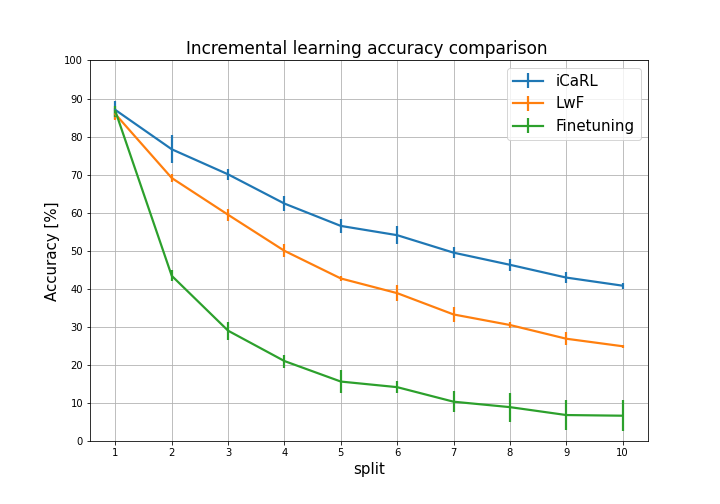
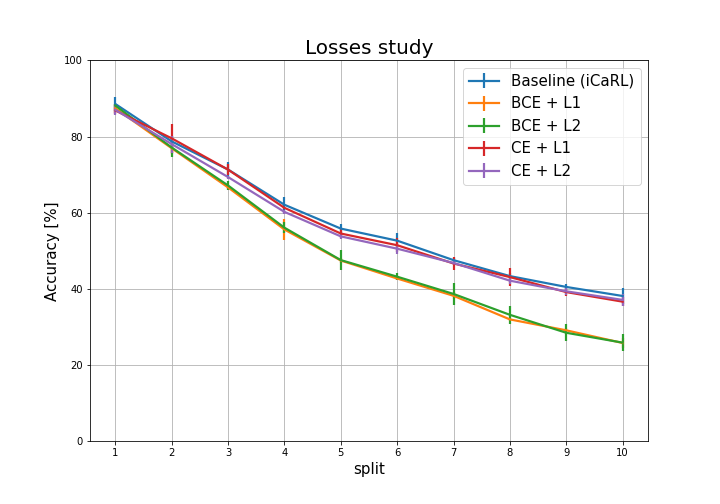
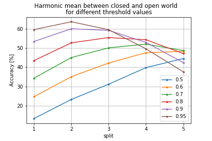
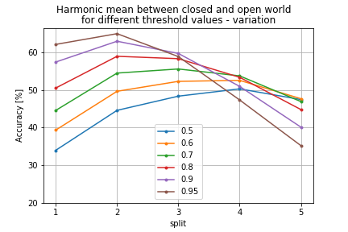
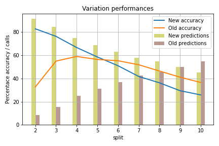
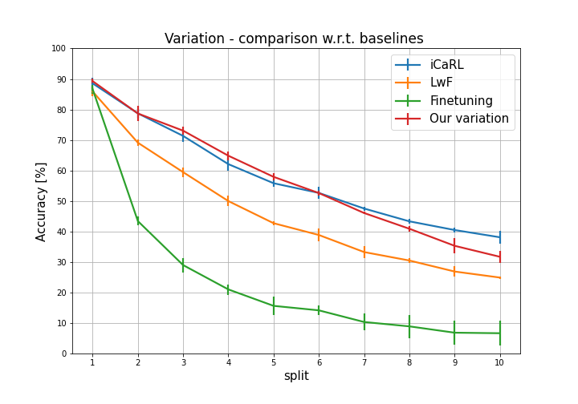

# OWR-ImageClassification
Open World Recognition in Image Classification project for Machine Learning and Deep Learning course's assignment - PoliTO

### Paper baseline implementation
* Finetuning
* Learning without forgetting (usage of distillation loss)
* iCarl (distillation + exemplars)

### Ablation studies:
* Classifiers
    - Nearest Mean Exemplars (iCaRL standard) **baseline**
    - Fully connected layer 
    - KNN
    - Cosine Layer + losses as detailed in 
        > Learning a Unified Classifier Incrementally via Rebalancing by Hue *et all* 

* Losses (classification + distillation)
    - iCaRL (BCE + lfc) **baseline**
    - BCE + L1
    - BCE + L2
    - CE + L1
    - CE + L2

### Open World setting:
* Naive rejection strategy

* Our variations

# Proposed variation

### Dataset usage - example

* Call the constructor `Cifar100Dataset('split', transform)`
* For each seed's iteration:
    - Call the function `.define_splits(seed)`
* For each split's iteration:
    - Call `.change_subclasses(iteration)` to select the list of 10 classes
    - Call `.get_imgs_by_target()` to retrieve all the images belonging to the 10 classes above, ready to fill the pytorch `Subset`.
